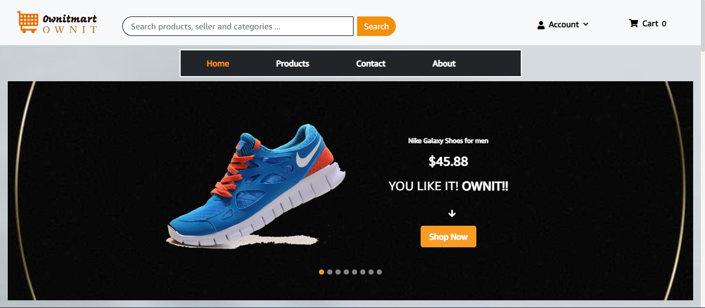

# OwnitMart E-commerce project

<table>
<tr>
<td>
Complete fullstack E-Commerce website makes it easy for people to find and buy different products. It's user-friendly for both customers and admins. Customers can browse and buy securely, while admins can easily manage products and orders. 
</td>
</tr>
</table>

## Demo

https://ownitmart.vercel.app/



## TOOLS USED

- Mongodb
- Express.js
- React.js
- node.js
- React Bootstrap
- Redux
- react-js-pagination
- axios
- react-router-dom
- formik
- react-alert

## Features

- Users Sign in/Sign up.
- Role Based Access Control for Users & Admins.
- Users can review or rate products.
- Users can buy place orders and pay.
- Admins can track platform activities like users reviews and orders.
- Admins can add, edit, delete products.

### ENV Variables

Create a .env file in the backend folder in config folder with name config.env Add yor variables in that as shown in the course

### Install Frontend Dependencies

```
cd frontend
npm i or npm install
```

### Install Dependencies (Backend)

```
npm i
```

### Seed Database

use the folling command to put som dummy products tn the database
Run it in the root folder

```
npm run seeder
```
